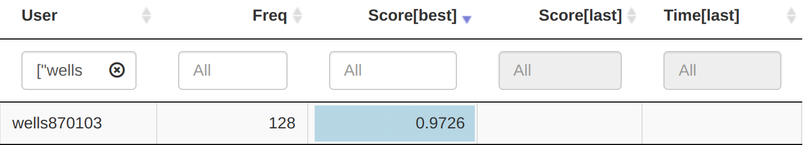
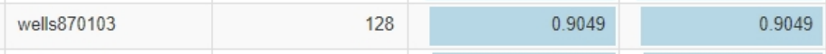

# 12Leads_EKG-CNN_LSTM
## Background
### Tracking left ventricular ejection fraction with continuous 12 leads ECG.

Left ventricular ejection fraction (LVEF) is the percentage of blood ejected from the left ventricle with each contraction. An LVEF of 60% means that 60% of the total blood volume in the left ventricle is ejected with each heartbeat. Echocardiography is the gold standard for measuring LVEF.

The normal ejection fraction of a healthy heart can range from 50% to 70%, while a left ventricular ejection fraction (LVEF) of less than 40% may indicate heart failure.

Continuous tracking of left ventricular ejection fraction (LVEF) through echocardiography is crucial for patients with heart failure. This can effectively manage their condition and monitor treatment improvements. However, echocardiography is expensive and requires skilled personnel to operate. If LVEF can be estimated through electrocardiography, it may enable more intensive monitoring and management of heart failure patients, thereby significantly improving the quality of medical care.

## Model Architecture
- Integreding channel-wide CNN and LSTM to inference result.
- Embedding prior EF value and concatenating before FNN.

## Evaluation
The final public board AUC is 97.26%, and the final private board AUC is 90.49%.
</img>
</img>
